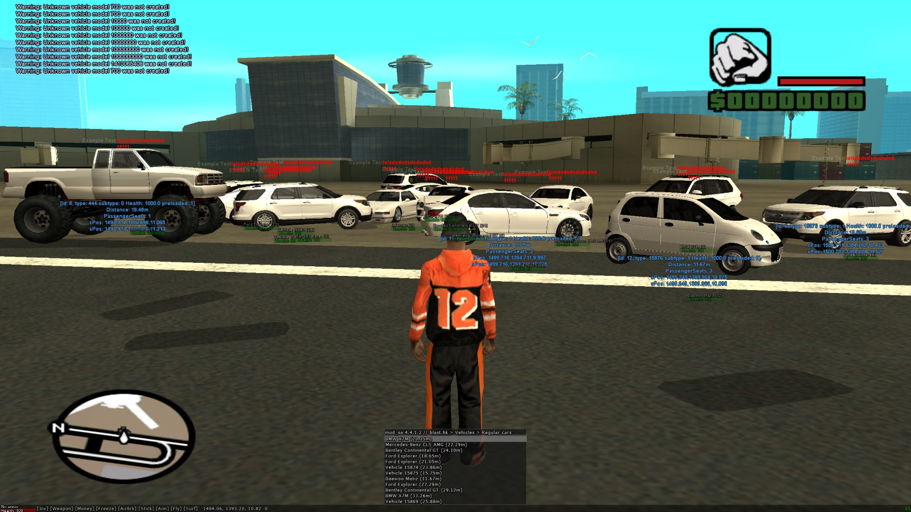

# samp_more_vehicles
Плагин, добавляющий поддержку кастомных авто в SA:MP  
&nbsp;


## Установка
1) Установите ASI Loader: https://github.com/ThirteenAG/Ultimate-ASI-Loader/releases
2) Переместите samp_more_vehicles.asi в папку с игрой (либо в папку scripts или plugins)
<br></br>
## Расширенные настройки
Расширенные настройки находятся в файле samp_more_vehicles.ini. Переместите его в папку с плагином, чтобы включить возможность редактировать настройки.  
&nbsp;
* Основные
```
[general]
enable_samp_fix = true
enable_mod_sa_fix = false
print_warning_in_chat = true
```

&nbsp;
* Шаблон для добавление версии SA:MP
```
# Заголовок должен начинаться с 'samp ' и быть уникальным

[samp 0.3.7-R1]
detect_signature = F8 03 6A 00 40 50 51 8D 4C 24 0C E8 82 02 01 00
patch_offset = 0x246915
pChat = 0x21A0E4
CChat_AddMessage = 0x645A0
CGame_CreateVehicle = 0x9B890
CGame_CreateVehicle_called_from_CVehiclePool_Create = 0x1B5EB
```

&nbsp;
* Шаблон для добавление версии mod_sa
```
# Заголовок должен начинаться с 'mod_sa ' и быть уникальным
# [general] enable_mod_sa_fix должен быть true

[mod_sa 4.4.1.3 (0.3.7 R1)]
module_name = d3d9.dll
detect_offset = 0x00073A64
detect_signature = 6D 6F 64 5F 73 61 20 34 2E 34 2E 31 2E 32 20 2F 2F 20 62 6C 61 73 74 2E 68 6B
gta_vehicle_get_by_id_pattern = 8B ** ** ** 2D 90 01 00 00 3D D3 00 00 00 77 ** C1 E0 04 05 ** ** ** ** C3
```

&nbsp;
* Имена авто
```
# Здесь можно добавить имена авто
# Необязательный параметр, в этой версии используется для "большего" фикса собейта
# Формат: id = name

[vehicle_names]
15750 = Chevrolet Camaro SS
```